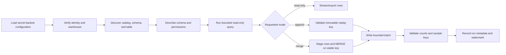

# Reusable Azure Databricks Connection and Data Transfer Guide

This guide explains how a developer, service, or agent can discover Unity Catalog objects and pull or push data in **any authorized catalog, schema, and table**. It extracts the reusable patterns already used by this repository and replaces project-specific names with configuration.

> **Core rule:** authentication, compute access, and Unity Catalog authorization are separate. A valid login is not enough: the identity must also be allowed to use the SQL warehouse and access the target catalog, schema, and table.

## 1. Choose the connection method

| Situation | Recommended method | Data interface |
|---|---|---|
| Developer exploring or troubleshooting | Databricks CLI with OAuth U2M | CLI and Statement Execution API |
| External Python application or agent | Databricks SQL Connector | SQL warehouse |
| Unattended service or CI/CD | OAuth M2M service principal | SQL Connector, SDK, or CLI |
| Code already running in Databricks | PySpark and `SparkSession` | Delta/Unity Catalog directly |
| BI or non-Python application | JDBC/ODBC | SQL warehouse |
| Large file-oriented transfer | Unity Catalog Volume plus `COPY INTO` | Files and Delta tables |

Do not use a personal access token for a shared or production agent when OAuth M2M or managed identity is available. Do not connect an external SQL client to jobs compute; use a SQL warehouse or supported all-purpose compute.

## 2. Values needed for a new project

Collect these values from the target Databricks workspace and SQL warehouse:

| Setting | Example format | Where to find it |
|---|---|---|
| Workspace host | `https://adb-<workspace-id>.<region>.azuredatabricks.net` | Workspace URL |
| Server hostname | `adb-<workspace-id>.<region>.azuredatabricks.net` | Warehouse **Connection details** |
| Warehouse ID | hexadecimal or numeric identifier | Warehouse URL, API, or CLI |
| HTTP path | `/sql/1.0/warehouses/<warehouse-id>` | Warehouse **Connection details** |
| Catalog | `my_catalog` | Catalog Explorer |
| Schema | `my_schema` | Catalog Explorer |
| Table | `my_table` | Catalog Explorer |
| CLI profile | `MY_PROJECT_DEV` | Chosen locally in `.databrickscfg` |

Use the three-level Unity Catalog name everywhere:

```text
catalog.schema.table
```

For this repository, the known mapping is:

```text
workspace = https://adb-7405605071306757.17.azuredatabricks.net
catalog   = 36889_janus_dev
sources   = 36889_janus_dev.defense_generation.defense_generation_results
            36889_janus_dev.`mitigation-check`.mitigation_check
            36889_janus_dev.bypass_validation.bypass_validation_results
target    = 36889_janus_dev.control_translation.control_translation_results
```

The workspace URL and object names are identifiers, not credentials. Never commit tokens, client secrets, `.databrickscfg`, or populated `.env` files.

## 3. Authentication

### 3.1 Interactive developer login: OAuth U2M

Install a current Databricks CLI, then authenticate from PowerShell:

```powershell
databricks auth login --host "https://adb-<workspace-id>.<region>.azuredatabricks.net" --profile MY_PROJECT_DEV
databricks current-user me --profile MY_PROJECT_DEV
```

The browser login creates a named profile. On Windows, current CLI versions normally keep OAuth tokens in Credential Manager rather than in the profile file.

Use the profile explicitly when several projects or workspaces are configured:

```powershell
databricks catalogs list --profile MY_PROJECT_DEV
databricks warehouses list --profile MY_PROJECT_DEV
```

Environment variables take precedence over profiles. A stale `DATABRICKS_TOKEN` can therefore override a working OAuth profile. Remove conflicting variables before diagnosing the profile.

### 3.2 Unattended agents: OAuth M2M

Create a Databricks service principal, assign it to the workspace, create a Databricks OAuth secret, grant it warehouse access, and grant only the required Unity Catalog privileges.

Store these values in the deployment secret store, such as Azure Key Vault:

```text
DATABRICKS_HOST=https://adb-<workspace-id>.<region>.azuredatabricks.net
DATABRICKS_CLIENT_ID=<service-principal-application-id>
DATABRICKS_CLIENT_SECRET=<secret-from-secret-store>
```

For the CLI or Databricks SDK, unified authentication automatically obtains and refreshes short-lived tokens. A workspace-level CLI profile has this shape:

```ini
[MY_PROJECT_SERVICE]
host          = https://adb-<workspace-id>.<region>.azuredatabricks.net
client_id     = <service-principal-client-id>
client_secret = <retrieve-at-runtime; do-not-commit>
```

Prefer environment injection from the runtime secret store instead of writing the secret to disk.

### 3.3 Personal access token: local fallback only

If organizational policy still requires a PAT for a local test, set it only in the current process or a non-committed secret file:

```powershell
$env:DATABRICKS_HOST = "https://adb-<workspace-id>.<region>.azuredatabricks.net"
$env:DATABRICKS_TOKEN = "<token>"
```

Rotate any credential that appears in source control, logs, chat, screenshots, or shell history.

## 4. Required permissions

The principal needs access at both the compute and data layers.

### Read one table

- `CAN USE` on the SQL warehouse.
- `USE CATALOG` on the catalog.
- `USE SCHEMA` on the schema.
- `SELECT` on the table or its parent schema/catalog.

### Insert, update, delete, or merge

- All read requirements above.
- `MODIFY` on the existing table. `MODIFY` permits insert, update, and delete and also requires `SELECT`.

### Create tables

- `USE CATALOG` on the catalog.
- `USE SCHEMA` and `CREATE TABLE` on the target schema.
- `SELECT` and `MODIFY` on created/existing target tables as required.

Example grants for an administrator to adapt:

```sql
GRANT USE CATALOG ON CATALOG `my_catalog` TO `my-service-principal`;
GRANT USE SCHEMA ON SCHEMA `my_catalog`.`source_schema` TO `my-service-principal`;
GRANT SELECT ON TABLE `my_catalog`.`source_schema`.`source_table` TO `my-service-principal`;

GRANT USE SCHEMA, CREATE TABLE ON SCHEMA `my_catalog`.`target_schema` TO `my-service-principal`;
GRANT SELECT, MODIFY ON SCHEMA `my_catalog`.`target_schema` TO `my-service-principal`;
```

Grant at table level when the agent needs only one table. Grant at schema level when it intentionally needs current and future tables in that schema. Avoid `ALL PRIVILEGES` by default.

Useful checks:

```sql
SHOW GRANTS ON CATALOG `my_catalog`;
SHOW GRANTS ON SCHEMA `my_catalog`.`my_schema`;
SHOW GRANTS ON TABLE `my_catalog`.`my_schema`.`my_table`;
```

## 5. Discover any catalog, schema, or table

### SQL discovery

```sql
SHOW CATALOGS;
SHOW SCHEMAS IN `my_catalog`;
SHOW TABLES IN `my_catalog`.`my_schema`;
DESCRIBE TABLE EXTENDED `my_catalog`.`my_schema`.`my_table`;
SELECT * FROM `my_catalog`.`my_schema`.`my_table` LIMIT 10;
```

Information schema is useful for agent-driven discovery:

```sql
SELECT table_catalog, table_schema, table_name, table_type
FROM `my_catalog`.information_schema.tables
WHERE table_schema = 'my_schema'
ORDER BY table_name;

SELECT table_catalog, table_schema, table_name, column_name,
       ordinal_position, full_data_type, is_nullable
FROM `my_catalog`.information_schema.columns
WHERE table_schema = 'my_schema'
  AND table_name = 'my_table'
ORDER BY ordinal_position;
```

Discovery returns only objects visible to the active identity. An empty list can mean missing permissions rather than an empty workspace.

### CLI discovery

```powershell
databricks catalogs list --profile MY_PROJECT_DEV
databricks schemas list my_catalog --profile MY_PROJECT_DEV
databricks tables list my_catalog my_schema --profile MY_PROJECT_DEV
databricks tables get my_catalog.my_schema.my_table --profile MY_PROJECT_DEV
```

### Select a warehouse

```powershell
databricks warehouses list --profile MY_PROJECT_DEV
```

Choose a warehouse the identity can use. Production agents should configure a specific warehouse ID rather than silently selecting the first visible warehouse.

## 6. Reusable Python SQL Connector

Install the connector in the new project:

```powershell
python -m pip install "databricks-sql-connector[pyarrow]" databricks-sdk
```

`pyarrow` is optional but recommended for larger result sets and CloudFetch.

### Configuration

Use separate environment variables for the SQL connector:

```text
DATABRICKS_SERVER_HOSTNAME=adb-<workspace-id>.<region>.azuredatabricks.net
DATABRICKS_HTTP_PATH=/sql/1.0/warehouses/<warehouse-id>
DATABRICKS_CLIENT_ID=<service-principal-client-id>
DATABRICKS_CLIENT_SECRET=<secret>
DATABRICKS_CATALOG=my_catalog
DATABRICKS_SCHEMA=my_schema
```

`DATABRICKS_HOST` includes `https://`; `DATABRICKS_SERVER_HOSTNAME` does not. Mixing these two formats is a common connection error.

### OAuth M2M connection factory

```python
import os
from databricks import sql
from databricks.sdk.core import Config, oauth_service_principal


def open_connection():
    hostname = os.environ["DATABRICKS_SERVER_HOSTNAME"]

    def credential_provider():
        return oauth_service_principal(
            Config(
                host=f"https://{hostname}",
                client_id=os.environ["DATABRICKS_CLIENT_ID"],
                client_secret=os.environ["DATABRICKS_CLIENT_SECRET"],
            )
        )

    return sql.connect(
        server_hostname=hostname,
        http_path=os.environ["DATABRICKS_HTTP_PATH"],
        credentials_provider=credential_provider,
        catalog=os.environ["DATABRICKS_CATALOG"],
        schema=os.environ["DATABRICKS_SCHEMA"],
        user_agent_entry="my-project-agent",
    )
```

For an interactive developer flow, replace `credentials_provider` with `auth_type="databricks-oauth"`. For a temporary PAT test, use `access_token=os.environ["DATABRICKS_TOKEN"]`.

### Safely select an arbitrary table

SQL parameters protect **values**, not object names. Validate catalog, schema, table, and column names before placing them in SQL.

```python
import re

_IDENTIFIER = re.compile(r"^[A-Za-z0-9_]+$")


def quote_name(*parts: str) -> str:
    if not 1 <= len(parts) <= 3 or any(not _IDENTIFIER.fullmatch(p) for p in parts):
        raise ValueError(f"Unsafe Databricks object name: {parts!r}")
    return ".".join(f"`{part}`" for part in parts)


def pull_rows(connection, catalog: str, schema: str, table: str, limit: int = 1000):
    if limit < 1 or limit > 100_000:
        raise ValueError("limit must be between 1 and 100000")
    target = quote_name(catalog, schema, table)
    with connection.cursor() as cursor:
        cursor.execute(f"SELECT * FROM {target} LIMIT ?", [limit])
        columns = [item[0] for item in cursor.description]
        return [dict(zip(columns, row, strict=True)) for row in cursor.fetchall()]
```

Use parameter markers for filters:

```python
cursor.execute(
    f"SELECT * FROM {target} WHERE updated_at >= ? AND status = ?",
    [watermark, "active"],
)
```

Never build a value filter with string concatenation.

### Stream a large pull

Do not call `fetchall()` for an unbounded result:

```python
def iter_rows(connection, statement: str, parameters=(), batch_size: int = 10_000):
    with connection.cursor() as cursor:
        cursor.execute(statement, list(parameters))
        columns = [item[0] for item in cursor.description]
        while batch := cursor.fetchmany(batch_size):
            yield [dict(zip(columns, row, strict=True)) for row in batch]
```

For columnar processing, install the PyArrow extra and use `fetchmany_arrow()`.

### Push a small batch

Use `executemany` for thousands of rows, not millions:

```python
def append_rows(connection, catalog: str, schema: str, table: str, rows):
    target = quote_name(catalog, schema, table)
    statement = f"INSERT INTO {target} (event_id, payload, created_at) VALUES (?, ?, ?)"
    with connection.cursor() as cursor:
        cursor.executemany(statement, rows)
```

Create the table separately under controlled deployment:

```sql
CREATE TABLE IF NOT EXISTS `my_catalog`.`my_schema`.`events` (
  event_id STRING NOT NULL,
  payload STRING,
  created_at TIMESTAMP NOT NULL
)
USING DELTA;
```

### Push a large batch

For large transfers:

1. Write Parquet/CSV/JSON files to an approved Unity Catalog Volume or cloud external location.
2. Load them into a staging Delta table with `COPY INTO`.
3. Validate counts and rejected records.
4. `MERGE` staging into the destination using stable business keys.
5. Record the run ID, source file/hash, row count, and completion state.

Example:

```sql
COPY INTO `my_catalog`.`my_schema`.`events_stage`
FROM '/Volumes/my_catalog/my_schema/my_volume/incoming/events/'
FILEFORMAT = PARQUET;

MERGE INTO `my_catalog`.`my_schema`.`events` AS target
USING `my_catalog`.`my_schema`.`events_stage` AS source
ON target.event_id = source.event_id
WHEN MATCHED THEN UPDATE SET *
WHEN NOT MATCHED THEN INSERT *;
```

`WRITE VOLUME` is required for writing to a volume. External-location writes require the appropriate external-location privileges and cloud configuration.

## 7. Code running inside Databricks: PySpark

Inside a Databricks notebook or Python task, authentication is supplied by the job/run identity. Configure the catalog and schema instead of external connection credentials.

### Pull

```python
source = "my_catalog.source_schema.source_table"
frame = spark.read.table(source)
filtered = frame.where("http_status BETWEEN 200 AND 299")
```

### Append

```python
filtered.write.format("delta").mode("append").saveAsTable(
    "my_catalog.target_schema.target_table"
)
```

### Overwrite only selected partitions/data

Avoid replacing an entire production table accidentally. Use a predicate and validate it:

```python
(
    filtered.write.format("delta")
    .mode("overwrite")
    .option("replaceWhere", "event_date = DATE '2026-08-26'")
    .saveAsTable("my_catalog.target_schema.target_table")
)
```

### Idempotent merge

```python
updates.createOrReplaceTempView("updates_for_merge")

spark.sql("""
MERGE INTO `my_catalog`.`target_schema`.`target_table` AS target
USING updates_for_merge AS source
ON target.event_id = source.event_id
WHEN MATCHED THEN UPDATE SET *
WHEN NOT MATCHED THEN INSERT *
""")
```

Use append only for immutable events with a replay key. Use `MERGE` for mutable entities. Avoid unrestricted overwrite.

## 8. Statement Execution API through the CLI

This repository's local integration harness uses the CLI as an authenticated transport to the SQL Statement Execution API. This is useful when the CLI profile already works and adding another authentication implementation is undesirable.

PowerShell example:

```powershell
$body = @{
    warehouse_id = "<warehouse-id>"
    statement = "SELECT * FROM ``my_catalog``.``my_schema``.``my_table`` LIMIT 10"
    wait_timeout = "50s"
    on_wait_timeout = "CONTINUE"
    format = "JSON_ARRAY"
    disposition = "INLINE"
} | ConvertTo-Json

$body | Set-Content -Encoding utf8 statement.json
databricks api post /api/2.0/sql/statements/ --json "@statement.json" --profile MY_PROJECT_DEV
Remove-Item statement.json
```

A reusable client must handle all of these cases:

1. Initial state can be `PENDING`, `RUNNING`, `SUCCEEDED`, or failed.
2. Poll `GET /api/2.0/sql/statements/<statement-id>` while pending/running.
3. Raise on any terminal state other than `SUCCEEDED`.
4. Read column names from `manifest.schema.columns`.
5. Follow `next_chunk_internal_link` until no chunks remain.
6. Bound result size and timeouts.
7. Do not log authorization headers, tokens, or sensitive result rows.

The implementation in `pocs/capabilities/vuln-intake/local_databricks_to_sqlite_canonicalization_test.py` demonstrates warehouse discovery, polling, chunk pagination, and mapping JSON arrays to dictionaries.

## 9. Patterns already proven in this repository

### Read-only Databricks to local storage

`pocs/capabilities/vuln-intake/local_databricks_to_sqlite_canonicalization_test.py`:

- authenticates with an existing CLI profile;
- discovers a visible SQL warehouse when an ID is not supplied;
- executes only `SELECT` against Databricks;
- polls asynchronous SQL statements;
- follows result chunks;
- writes transformed results only to a dedicated local SQLite database;
- records processed `(source_id, payload_sha256)` pairs for replay safety.

Reuse its transport functions when a CLI-based, read-only integration is appropriate. For production, replace automatic first-warehouse selection with required configuration.

### Databricks-native read and write

`pocs/capabilities/vuln-intake/databricks_cve_enrichment_job.py`:

- accepts configurable source table, target catalog, and target schema;
- validates object identifiers before interpolating them into SQL;
- reads Delta tables through `spark.table`;
- writes idempotently with Delta `MERGE`;
- inserts the processed-event ledger last so interrupted runs can retry;
- uses checkpoints to reduce scans, while the replay ledger provides correctness;
- records running/completed/failed status and metrics.

### Controlled table creation

`pocs/capabilities/vuln-intake/sql/005_canonical_vulnerability_tables_databricks.sql` separates reviewed DDL from runtime data movement. Follow the same approach in other projects:

1. Review and run DDL once.
2. Run jobs in a mode that fails if required tables are absent.
3. Use migrations for later schema changes; `CREATE TABLE IF NOT EXISTS` is not a migration system.

## 10. Reusable agent contract

Give another coding agent this input contract instead of hard-coded project details:

```yaml
databricks:
  profile: MY_PROJECT_DEV                 # local development only
  host: https://adb-<id>.<region>.azuredatabricks.net
  warehouse_id: <warehouse-id>
  server_hostname: adb-<id>.<region>.azuredatabricks.net
  http_path: /sql/1.0/warehouses/<warehouse-id>
  source:
    catalog: my_catalog
    schema: source_schema
    table: source_table
  target:
    catalog: my_catalog
    schema: target_schema
    table: target_table
  mode: read-only                         # read-only | append | merge
  batch_rows: 10000
  key_columns: [event_id]
  watermark_column: updated_at
```

Require the agent to follow these rules:

1. Never request, print, or commit a token or client secret.
2. Confirm identity and warehouse access before accessing data.
3. Discover and describe the target table before generating mappings.
4. Use fully qualified three-level names.
5. Validate identifiers; parameterize values.
6. Start with `SELECT ... LIMIT` and read-only validation.
7. Compare source and target schemas before writing.
8. Require an explicit write mode; never infer overwrite.
9. Use stable keys and `MERGE` for retryable writes.
10. Capture run ID, row counts, source watermark/hash, and errors.
11. Verify post-write counts and sample keys.
12. Stop on schema drift, missing keys, privilege errors, or unexpected row volume.

## 11. Safe pull/push workflow



Recommended sequence:

1. Verify the authenticated identity.
2. Verify the configured warehouse exists and is usable.
3. List the catalog, schema, and table.
4. Inspect columns, types, nullability, and table properties.
5. Run `SELECT COUNT(*)` only if the expected cost is acceptable; otherwise sample and use metadata.
6. Pull a bounded sample.
7. Validate column mapping locally.
8. For writes, use a development table first.
9. Stage and merge a small batch.
10. Verify row counts, key uniqueness, and representative records.
11. Enable scheduling only after replay testing succeeds.

## 12. Troubleshooting

| Symptom | Likely cause | Action |
|---|---|---|
| `401 Unauthorized` | Wrong/expired credentials or wrong host | Confirm host has no `/api`; re-login or rotate secret; remove conflicting auth variables |
| `403 Forbidden` | Missing workspace, warehouse, or Unity Catalog permission | Check workspace assignment, warehouse `CAN USE`, then grants |
| Catalog/schema/table not found | Wrong three-level name or object hidden by permissions | Run discovery commands under the same identity |
| Hostname/DNS error | Used full URL as server hostname, bad DNS, proxy/firewall | Use hostname without `https://` for SQL connector; verify network path |
| Query remains pending | Warehouse starting, queued, or wrong ID | Inspect warehouse state and SQL history; use a configured warehouse ID |
| Query succeeds but client misses rows | Result chunk pagination not implemented | Follow every `next_chunk_internal_link` or use SQL Connector |
| Memory exhaustion | Unbounded `fetchall()` | Filter, project needed columns, paginate, or use `fetchmany_arrow()` |
| Duplicate rows after retry | Append without replay key | Stage and `MERGE` on stable keys; record processed source hashes |
| Schema mismatch | Source changed or target DDL is stale | Stop the write, compare metadata, and apply a reviewed migration |
| CloudFetch/network failure | Client cannot reach cloud object storage URLs | Fix egress or set `use_cloud_fetch=False` with expected performance impact |

## 13. Security and operational checklist

- [ ] OAuth U2M for developers; OAuth M2M or managed identity for automation.
- [ ] Secrets stored in Azure Key Vault or the runtime's approved secret store.
- [ ] No populated `.env`, `.databrickscfg`, tokens, or statement payloads containing secrets in Git.
- [ ] Dedicated service principal per application/environment.
- [ ] `CAN USE` only on the intended warehouse.
- [ ] Least-privilege Unity Catalog grants.
- [ ] Explicit catalog, schema, table, warehouse, and write mode.
- [ ] Parameterized values and validated identifiers.
- [ ] Bounded reads and batch sizes.
- [ ] Idempotent writes using stable keys, hashes, or Delta `MERGE`.
- [ ] Run ledger, metrics, and failure state.
- [ ] Schema-drift checks and reviewed migrations.
- [ ] Development validation before production scheduling.

## 14. Official references

- [Databricks SQL Connector for Python](https://learn.microsoft.com/azure/databricks/dev-tools/python-sql-connector)
- [Databricks CLI authentication](https://learn.microsoft.com/azure/databricks/dev-tools/cli/authentication)
- [OAuth M2M for service principals](https://learn.microsoft.com/azure/databricks/dev-tools/auth/oauth-m2m)
- [Unity Catalog privileges reference](https://learn.microsoft.com/azure/databricks/data-governance/unity-catalog/manage-privileges/privileges)

The APIs and permissions in this guide were checked against Azure Databricks documentation available on 2026-08-26.
