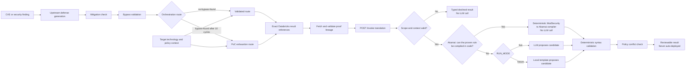
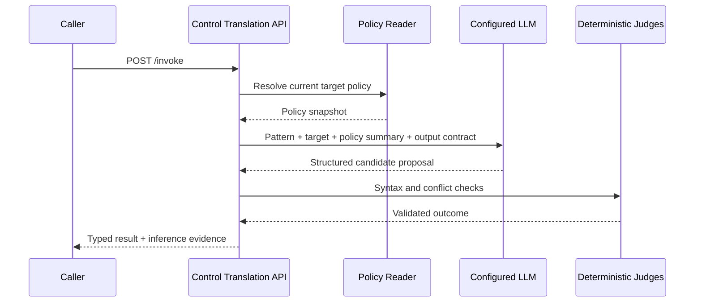
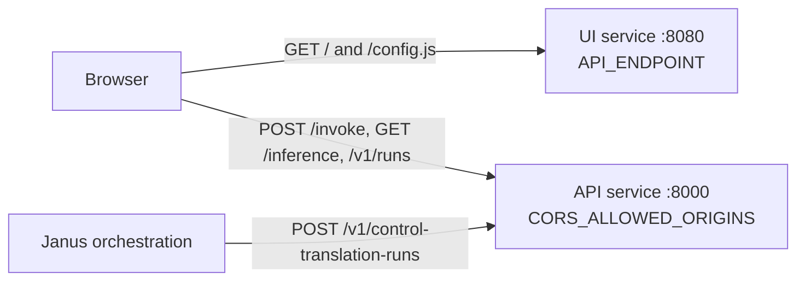
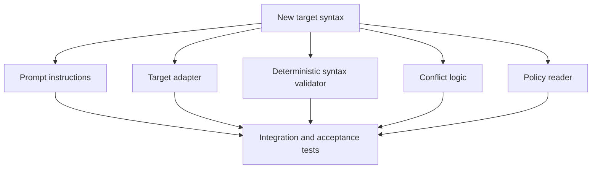
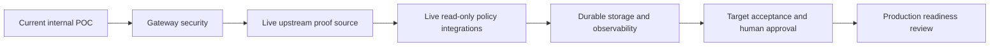

# control-translation service

Turns a proven mitigation pattern into a control-specific mitigation
candidate for a target technology (Akamai WAF, generic firewall, or an
EDR/S1 stub) — or a grounded reason it cannot be produced. Implements the
Janus `control-translation` Capability Functional Specification (CFS).

## Source provenance

- CFS source: `artifacts/capabilities/cfs-control-translation.md` in the
  `apm0000000-ai-tiger-team-janus` repo (v1.0). See `docs/cfs-source.md`.
- This is a standalone repo, independent of the Janus repo.

## Review docs

- CFS extraction: `docs/cfs-extraction.md`
- POC design: `docs/poc-design.md`
- Implementation / low-level design: `docs/LLD.md`
- Orchestration integration contract: `docs/orchestration-integration.md`
- Databricks persistence runbook: `docs/databricks-persistence.md`
- Assumptions and follow-ups: `docs/assumptions-and-followups.md`

## What this service does

- Accepts authoritative Databricks result references from orchestration or a
  legacy direct proven-pattern input.
- Fetches exact Defense Generation, Mitigation Check, and Bypass Validation
  result IDs and validates correlation, subject, vulnerability, candidate,
  and terminal-state lineage before translation.
- Accepts both the validated (`no-bypass-found`) and ten-cycle PoC exhaustion
  (`bypass-found` + `loop_exhausted`) routes. The temporary PoC exhaustion
  route may emit a translated candidate, but always marks it as not
  bypass-cleared and preserves the authoritative bypass qualification.
- Reads a current policy snapshot (fixture-backed).
- Calls a translation agent (doer) to propose a candidate rule/config.
- Gates the proposal through deterministic syntax validation and conflict
  detection (judge) before allowing a `translated` verdict.
- Emits a typed `ControlTranslationResult` with one of five terminal
  states: `translated`, `cannot-express`, `insufficient-context`,
  `scope-declined`, `malfunction`.
- Generates missing request/correlation identifiers before hashing and durable
  persistence while preserving caller-provided identifiers.
- Emits redacted operational diagnostics for deployment troubleshooting and
  keeps complete tracebacks in server/container logs.

It produces a **candidate only**. It does not approve, publish, or deploy a
rule to a target security product.

## End-to-end flow



The CVE is not itself the control. Orchestration runs the candidate proof
loop and passes exact result references. This service reads those rows,
assembles a lineage-checked internal pattern, and translates it to one target.
It never selects a conveniently recent row and never changes upstream data.

## What is sent to the LLM

A model is called only when live mode is configured *and* no deterministic
path can express the proven pattern (see **Default Akamai execution path**).
When one is called, the server sends:

- target technology and expected artifact type;
- the proven discriminator description and mitigation summary;
- summaries from the resolved policy snapshot;
- target-format instructions and a strict structured-output contract.

The model is asked to return the candidate content, an `exact`, `equivalent`,
or `narrower` translation label, justification, assumptions, and limitations.
Credentials are sent only in the server-to-provider authorization header.
They are never accepted from or returned to the browser.



## Default Akamai execution path

For `akamai-waf`, the candidate is derived from the authoritative upstream
records **in code**. The translation doer -- the fixture template or the live
LLM -- is a fallback, not the primary path. `translation/engine.py` tries these
in order and stops at the first one that can express the proven pattern:

| Order | `proposal_source` | Source of truth |
|---|---|---|
| 1 | `deterministic-json-body-field` | the JSON request field uniquely corroborated by Mitigation Check |
| 2 | `deterministic-anchored-literal` | an anchored literal named-argument value in the proven rule |
| 3 | `deterministic-form-body` | the authoritative proven form request body |
| 4 | `deterministic-modsec-rule` | **general compilation of the proven ModSecurity rule itself** |
| 5 | `translation-doer` | fixture template or live LLM |

Rows 1-3 handle specific high-fidelity shapes. Row 4,
`translation/modsec_akamai.py`, is the general path: the proven
`SecRule` carried in the defense-generation artifact is parsed and compiled
into the Akamai custom-rule JSON documented in `docs/syntexresearch.md`.
Every result reports which path ran in `inference.proposal_source`, and the
demo UI shows it next to `llm_invoked`.

### What the compiler maps

| ModSecurity | Akamai condition |
|---|---|
| `ARGS`, `ARGS_POST`, `REQUEST_BODY` | `argsPostMatch` |
| `ARGS_GET`, `QUERY_STRING` | `uriQueryMatch` |
| `XML` | `argsPostXMLMatch` |
| `REQUEST_HEADERS:Name` / `REQUEST_HEADERS` | `requestHeaderValueMatch` / `requestHeaderMatch` |
| `REQUEST_URI`, `REQUEST_URI_RAW`, `REQUEST_FILENAME` | `pathMatch` |
| `REQUEST_COOKIES` | `cookieMatch` |
| `REQUEST_METHOD` | `requestMethodMatch` |
| `REMOTE_ADDR` (with `@ipMatch`) | `ipMatch` |

Operators: `@rx`, `@contains`, `@beginsWith`, `@endsWith`, `@streq`, `@eq`,
`@within`, `@pm`, `@ipMatch`, each with `!` negation mapping to
`positiveMatch: false`. Alternative variables (`A|B`) become an `OR` rule;
`chain`ed directives become an `AND` rule.

`@rx` arguments are compiled into Akamai wildcard values: anchors decide
whether the value is wrapped in `*`, alternations and small character classes
are expanded into separate values, and `.`/`.*` become `?`/`*`. Pure-literal
body, query, and path values also carry their URL-encoded, plus-encoded, and
double-encoded transport forms, because the edge sees the request before
ModSecurity's decoding transformations.

### Encoding ladders

Defense generation often enumerates recursive URL-encodings of a single
character per alternation group:

```
person(?:\[|%5B|%255B|%25255B|%2525255B|%252525255B|%25252525255B)0(?:\]|%5D|...)...
```

Akamai `value` entries are flat wildcard strings with no alternation, so
expanding five such groups positionally is a cross-product — 7^5 = 16,807
values, past the 32-value cap — and the rule would decline.

The compiler recognizes a group whose every branch is the previous branch
URL-encoded once more, and aligns all such groups to a common depth. Real
traffic encodes a value uniformly; one with `[` raw but `]` double-encoded is
not worth enumerating. The result is one value per depth, seven instead of
16,807, and every emitted value is one the source rule matches — so the
candidate is a strict subset and can never over-block.

Ladders of differing lengths have no common depth to align on and decline
rather than guess; an ordinary alternation is not a ladder and still expands
normally; and alignment does not lift the value cap.

### What it refuses

The compiler declines -- and the request falls back to the doer -- rather than
guess. Counted repetition (`{n,m}`), lookarounds, backreferences, quantified
multi-character groups, regex variable selectors, unlisted collections and
operators, implicit operators, expansions past 32 values, and any literal `*`
or `?` colliding with wildcard matching all decline.

### Fidelity labels

A mapping that preserves the source match set is labeled `equivalent`. When a
construct has no wildcard image -- `\s`, `\d`, `\w`, negated or large
character classes, `\b`, a quantified literal -- it is generalized to a
wildcard and the candidate is labeled `narrower`, with an explicit limitation
recording that generalization **can match a broader set of requests than the
source rule** and requires operator collateral-impact review. As everywhere
else in this service, the candidate is shape-validated only, carries no
embedded action, and is never auto-deployed.

## What is real vs. fixture-backed

- **Real:** FastAPI HTTP surface, Pydantic contracts, exact Databricks SQL
  reads from three upstream result tables, cross-record lineage and route
  validation, SQLite/Databricks result persistence, terminal-state routing,
  deterministic syntax/conflict gates, the ModSecurity-to-Akamai custom-rule
  compiler, and (when `RUN_MODE=live` and no deterministic path applies) a real
  model call. AT&T Inference uses its OpenAI-compatible HTTP API; other configured
  providers use Pydantic AI.
- **Fixture-backed:** policy snapshot reads (no live Akamai/Palo
  Alto/SentinelOne API access), legacy direct-input samples, and the default
  `FixtureTranslationDoer`.

See `docs/assumptions-and-followups.md` for the full list and backlog.

## Services

This repository builds **three deployables**:

| Service | Module | Image | Default port | Holds |
|---|---|---|---|---|
| Capability API (Python) | `control_translation` | `Dockerfile` | 8000 | contracts, upstream reads, translation, persistence, credentials |
| Capability API (Go, lean) | `go-api` | `go-api/Dockerfile` | 8000 | the ModSecurity→Akamai compiler, sync + async routes, Databricks results |
| Demo UI | `control_translation_ui` | `Dockerfile.ui` | 8080 | static assets only — no credentials, no capability state |

The Go service exists because **the Python service is being phased out**. It is
deliberately lean: one execution path (read the proven ModSecurity rule from
the Defense Generation row the request names, compile it into an Akamai custom
rule), one target technology, and the same persistence split as the Python
service — SQLite coordinates the asynchronous lifecycle queue, Databricks
stores the immutable results.

`go-api/README.md` lists exactly what was removed and what has and has not been
verified. In short: the compiler is pinned byte-for-byte to the Python
service's output, the HTTP surface, the upstream reader and the lifecycle are
tested against an in-process fake workspace, and **nothing has been run against
a live Databricks workspace**.

The browser loads the page from the UI service and calls the API **directly**.
The UI service carries no API traffic. Two settings must therefore agree, and
both are expressed as the *browser* sees them, never as internal service DNS:

- UI `API_ENDPOINT` — the API's browser-reachable base URL. It is published to
  the page at `/config.js`, so it must never be an internal-only hostname.
- API `CORS_ALLOWED_ORIGINS` — the UI's origin. It is empty by default, which
  means no browser may call the API at all.



## Install & run

Requires Python 3.11+ and [uv](https://docs.astral.sh/uv/).

```bash
uv sync
uv run pytest -q
```

Run the services in separate terminals:

```bash
uv run uvicorn control_translation.api:app --reload --port 8000
```

Or run the lean Go service instead (it needs real `DATABRICKS_*` settings and a
writable `DATABASE_PATH`, or `/ready` fails):

```bash
cd go-api && go test ./... && go run ./cmd/api
```

```bash
API_ENDPOINT=http://127.0.0.1:8000 uv run uvicorn control_translation_ui.app:app --reload --port 8080
```

The API needs `CORS_ALLOWED_ORIGINS=http://127.0.0.1:8080` in `.env` or the
browser will block every call from the UI. `.env.example` already sets it.

Then open http://127.0.0.1:8080/ for the demo UI and
http://127.0.0.1:8080/demo.html for the team flow guide. Swagger UI stays on
the API at http://127.0.0.1:8000/docs.

Both services are also started together by `docker compose up --build`, which
wires the two settings for you.

## Configuration

Copy `.env.example` to `.env` and fill in real values as needed:

```bash
cp .env.example .env
```

Default `RUN_MODE=fixture` requires no model or API key. Set `RUN_MODE=live`
and provide all settings for the selected provider. No LLM base endpoint,
model ID, or API key is hardcoded in application code or the image.

| Variable | Required | Purpose |
|---|---|---|
| `RUN_MODE` | Yes | `fixture` or `live` |
| `MODEL_PROVIDER` | Live | `att-inference`, `openai`, or configured Pydantic AI provider |
| `MODEL_NAME` | Live | Tenant-approved model/deployment ID |
| `ATT_INFERENCE_BASE_URL` | AT&T live | OpenAI-compatible base URL, supplied at deployment |
| `ATT_INFERENCE_API_KEY` | AT&T live | Secret-store reference/value, never committed |
| `OPENAI_API_KEY` | OpenAI live | Secret-store reference/value |
| `AZURE_OPENAI_ENDPOINT` | Azure live | Deployment endpoint |
| `AZURE_OPENAI_API_KEY` | Azure live | Secret-store reference/value |
| `AZURE_OPENAI_API_VERSION` | Azure live | Provider API version |
| `MODEL_REQUEST_TIMEOUT_SECONDS` | No | Model timeout, `1-300`; default `60` |
| `PERSISTENCE_BACKEND` | No | `sqlite` (default) or `databricks` |
| `DATABASE_PATH` | No | SQLite file path; default `./data/control_translation.db` |
| `DATABRICKS_SERVER_HOSTNAME` | Databricks | SQL workspace hostname (without `https://`) |
| `DATABRICKS_HTTP_PATH` | Databricks | SQL warehouse HTTP path |
| `DATABRICKS_AUTH_TYPE` | Databricks | `oauth-m2m` (recommended/default) or `pat` for temporary local testing |
| `DATABRICKS_TOKEN` | Databricks PAT | Personal access token; secret and never committed |
| `DATABRICKS_CLIENT_ID` | Databricks OAuth | OAuth M2M service-principal application ID |
| `DATABRICKS_CLIENT_SECRET` | Databricks OAuth | Secret-store injected OAuth secret; never committed |
| `DATABRICKS_CATALOG` | Databricks | Unity Catalog catalog; defaults to `36889_janus_dev` |
| `DATABRICKS_SCHEMA` | Databricks | Unity Catalog schema; defaults to `control_translation` |
| `DATABRICKS_RESULTS_TABLE` | Databricks | Existing results table; defaults to `control_translation_results` |
| `CAPABILITY_CALLBACK_TOKEN` | Callback submit | Secret-store injected bearer token; never returned or logged |
| `CAPABILITY_CALLBACK_ALLOWED_HOSTS` | No | Comma-separated orchestration callback hostname allowlist |
| `CAPABILITY_CALLBACK_TIMEOUT_SECONDS` | No | Callback HTTP timeout; default `10` |
| `CAPABILITY_CALLBACK_POLL_INTERVAL_SECONDS` | No | Durable outbox scan interval; default `1` |
| `DEFAULT_TARGET_TECHNOLOGY` | No | PoC fallback target; caller value wins; default `akamai-waf` |
| `DEFAULT_TARGET_POLICY_CONTEXT_ID` | No | PoC fallback policy context; caller value wins |
| `HOST` | No | API bind host; default `0.0.0.0` |
| `PORT` | No | API bind port; default `8000` |
| `ENABLE_DOCS` | No | Enable `/docs`, `/redoc`, and `/openapi.json` |
| `CORS_ALLOWED_ORIGINS` | Browser access | Comma-separated UI origins allowed to call the API. Empty by default; `*` is rejected |

The demo UI service reads only these, and nothing else:

| Variable | Required | Purpose |
|---|---|---|
| `API_ENDPOINT` | Yes | API base URL **as the browser resolves it**; published at `/config.js`. Empty means same-origin |
| `UI_HOST` | No | UI bind host; default `0.0.0.0` |
| `UI_PORT` | No | UI bind port; default `8080` |
| `UI_STATIC_DIR` | No | Static asset directory; defaults to `ui/` beside the package |

A UI deployment needs no model, Databricks, or callback settings. Do not copy
the API's `.env` into the UI container.

### AT&T Inference

AT&T Inference is supported as an OpenAI-compatible live provider. Obtain
the model ID, OpenAI-compatible base URL, and API key from the AT&T
Inference tenant / approved secret store, then set these **server-side**
values in `.env` (or equivalent deployment secrets):

```dotenv
RUN_MODE=live
MODEL_PROVIDER=att-inference
MODEL_NAME=<ATT_INFERENCE_MODEL_ID>
ATT_INFERENCE_BASE_URL=<ATT_INFERENCE_OPENAI_COMPATIBLE_BASE_URL>
ATT_INFERENCE_API_KEY=<SET_FROM_SECRET_STORE>
```

Never put `ATT_INFERENCE_API_KEY` in the browser, source code, or a
committed `.env` file. The service only exposes a boolean indicating whether
credentials are configured; it never returns the key or endpoint through
`/inference`, `/schema`, or an invocation result.

For deployment, inject secrets through the platform secret store. Do not copy
a developer `.env` into an image. If a credential has appeared in a shared
screen, transcript, ticket, or log, revoke and rotate it before deployment.

### Switching modes and demonstrating LLM use

Mode selection is intentionally restart-based rather than a browser-side
toggle, so a UI visitor cannot set or receive a production credential.

1. In the demo UI's **Inference runtime** card, choose **AT&T Inference —
  live LLM** and select **Copy configuration**.
2. Paste the settings into `.env`, replace the three placeholders with
  approved tenant/secret-store values, and restart Uvicorn or the container.
3. Refresh the UI. The runtime card must show **Live LLM enabled**, the
  configured provider, and model.
4. Submit a compatible example with a known policy context, for example
  **CVE-2017-5638 → Akamai WAF**. The response includes an **Inference
  evidence** panel. `LLM invoked for this request: yes` demonstrates that
  the request reached the live translation agent. The deterministic syntax
  and conflict gates still run after model output.
5. To return to the offline demonstration, set `RUN_MODE=fixture` and
  restart. The runtime card and response will report fixture mode and
  `LLM invoked: no`.

If an input is rejected for scope or missing policy context before the
translation stage, it correctly reports `LLM invoked: no` even in live mode.

## Invoke

## Asynchronous orchestration lifecycle

New orchestration integrations use the durable polling API rather than holding
an HTTP request open while translation runs:

```text
POST /v1/control-translation-runs
GET  /v1/control-translation-runs/{run_id}
GET  /v1/control-translation-runs/{run_id}/result
POST /v1/control-translation-runs/{run_id}/cancel
```

Submission requires `Idempotency-Key` and `X-Correlation-ID`. The body
`request_id` must equal the idempotency header, and body `correlation_id` must
equal the correlation header. The request is normalized, SHA-256 hashed, and
persisted as `queued` before the worker is signaled. An identical retry returns
the same run. Reusing the key with changed semantic input returns
`409 idempotency_conflict`.

Workers claim persisted runs with a durable lease, heartbeat while inference
or upstream resolution is active, and recover expired leases on startup or
failover. `WORKER_MAX_ATTEMPTS` bounds recovery. Completion stores an immutable
service result and compact canonical completion containing its Databricks
reference, SHA-256, and byte size. Status polling never starts work. The async
submit route accepts the optional all-or-none `X-Janus-Callback-URL`,
`X-Janus-Callback-Workflow-ID`, and `X-Janus-Callback-Signal` header group.
Body `callback` values receive `400 callback_not_supported`; polling remains
available through callback retries and configuration failures.

Deployment lifecycle state is stored at
`/app/data/control_translation.db` on a durable mounted volume with SQLite
`DELETE` journaling. Run exactly one service replica (`SERVICE_REPLICA_COUNT=1`).
When `PERSISTENCE_BACKEND=databricks`, completed immutable results are written
to Databricks while queues, leases, cancellation, and polling state remain in
SQLite. SQLite also holds a fenced publication outbox containing the exact
canonical result and completion metadata. Recovery reuses that staged output
and verifies the idempotent Databricks row before atomically finalizing the
lifecycle, so translation is not regenerated after a publish/finalize crash.
Cancellation wins before publication becomes pending; afterward canonical
completion wins because the Databricks write may already have succeeded.

`POST /invoke` remains a synchronous compatibility facade and preserves its
existing request and result contracts, including structured candidate output.

### Orchestration route (recommended)

Orchestration calls `POST /invoke` after completing either accepted route:

1. **Validated:** Mitigation Check is `blocked`, Bypass Validation is
  `no-bypass-found`, and `loop_exhausted=false`.
2. **PoC exhaustion:** Mitigation Check is `blocked`, the latest Bypass
  Validation result is `bypass-found`, and orchestration supplies
  `loop_exhausted=true`, `completed_iterations=10`, and `max_iterations=10`.

Every referenced request includes `correlation_id`,
`subject_record_revision_id`, all three `upstream_result_refs`, and
`routing_metadata`. The routing Bypass Validation reference must exactly match
the authoritative reference in `upstream_result_refs`.

Complete request templates:

- `examples/request-referenced-validated.json`
- `examples/request-referenced-exhausted.json`

The service reads exactly the referenced IDs from:

- `36889_janus_dev.defense_generation.defense_generation_results`;
- ``36889_janus_dev.`mitigation-check`.mitigation_check``;
- `36889_janus_dev.bypass_validation.bypass_validation_results`.

It requires one matching candidate, vulnerability, correlation, and subject
revision across those rows. Missing or ambiguous lineage produces
`insufficient-context`; the service does not guess or fall back to a recent
row. See `docs/orchestration-integration.md` for the full contract, examples,
response handling, retries, permissions, and source-column details.

The response preserves the route in
`structured_result.proof_loop_qualification`. For PoC exhaustion,
`bypass_cleared` remains `false`, the latest `bypass-found` state/reference is
retained, and the primary candidate contains an explicit not-bypass-cleared
limitation. Bounded counterexample and evidence references are retained when
supplied by Bypass Validation.
One invocation produces at most one primary candidate.

### Legacy direct route

`POST /invoke` also accepts a strict canonical `bypass-validation@1.0` result
as a temporary compatibility input. Because this result describes mutation
attempts for one candidate and does not prove that the orchestration candidate
loop exhausted 10 iterations, the service always returns
`scope-declined`/`bypass-found-requires-regeneration`, preserves its bounded
counterexample and evidence references, emits no primary candidate, and never
calls the LLM. Its `result_id` becomes the stable request/idempotency identity.
See `examples/request-direct-bypass-found.json`.

The legacy proven-pattern route remains available for existing direct clients.

Direct Python:

```python
from control_translation import capability
from control_translation.contracts import ControlTranslationRequest, TargetContext
from control_translation.providers.fixtures import get_fixture_pattern

request = ControlTranslationRequest(
    proven_pattern=get_fixture_pattern("proven-pattern:CVE-EXAMPLE:waf:3"),
    target_context=TargetContext(
        target_technology="akamai-waf",
        target_policy_context_id="akamai-policy:example:rev-17",
    ),
)
result = capability.invoke(request)
```

HTTP:

```bash
curl -sS -X POST http://127.0.0.1:8000/invoke \
  -H 'content-type: application/json' \
  -d @examples/request-translated.json | jq
```

The direct proven-pattern route remains for fixtures and backward
compatibility. Production orchestration should use exact references so Control
Translation can retrieve and verify the authoritative records itself.

Optional caller-provided `request_id` and `correlation_id` values are preserved
across the durable result and response. Missing values are generated by the
API before hashing and persistence. Callers may also provide an
`idempotency_key`; repeating the same
validated request with that key returns the original run, while reusing the
key for different input returns HTTP `409`. Orchestration may provide the
optional `subject_record_revision_id`; it must identify the authoritative
subject revision. Input, upstream references, routing metadata, scope, subject
revision, and provenance participate in the semantic idempotency hash.

### Changing input or target output formats

- **Different CVE/control, same contract:** no code change is required. Send
  the new proven pattern in `/invoke`.
- **Add optional upstream metadata:** update the Pydantic request contract,
  regenerate `schemas/request.schema.json`, and add compatibility tests.
- **Tune output for an existing target:** prompt changes can guide the model,
  but prompt changes alone are not a safe production change. Update the
  target adapter and deterministic syntax tests at the same time. For
  `akamai-waf`, most output changes belong in
  `translation/modsec_akamai.py`, not in the prompt, because the compiler
  runs before the model.
- **Support another ModSecurity construct for Akamai:** extend
  `translation/modsec_akamai.py` (`_COMPONENTS` for a collection,
  `_operator_match` for an operator, `_RegexTranslator` for a regex form) and
  add a case to `tests/test_modsec_akamai.py`. Declining is always the correct
  behavior when the Akamai equivalent is not certain.
- **Add a new target technology:** add an adapter, register it in
  `ADAPTER_REGISTRY`, map its control class, add target prompt instructions,
  implement a policy reader/snapshot, and add syntax/conflict fixtures and
  tests.



This separation is intentional: the LLM constructs a proposal, while code
decides whether that proposal is structurally acceptable.

## HTTP endpoints

| Method | Path | Purpose |
|---|---|---|
| `GET` | `/health` | Process liveness |
| `GET` | `/ready` | Configuration/deployment readiness; returns `503` if invalid |
| `GET` | `/inference` | Safe mode/provider/model status; never returns keys/endpoints |
| `GET` | `/schema` | Capability and supported-target summary |
| `POST` | `/invoke` | Submit one translation request |
| `POST` | `/v1/control-translation-runs` | Persist and queue one asynchronous translation |
| `GET` | `/v1/control-translation-runs/{run_id}` | Read compact durable lifecycle status |
| `GET` | `/v1/control-translation-runs/{run_id}/result` | Read the immutable terminal result |
| `POST` | `/v1/control-translation-runs/{run_id}/cancel` | Request idempotent cancellation |
| `GET` | `/v1/runs?limit=25&offset=0` | List safe, newest-first run summaries for the dashboard |
| `GET` | `/runs/{run_id}` | Read a durable completion envelope by execution ID |
| `GET` | `/v1/results/{result_id}` | Read the durable structured business result |
| `GET` | `/docs` | Swagger UI when `ENABLE_DOCS=true` |
| `GET` | `/` | Service descriptor; the demo UI is no longer served here |

The demo UI service exposes its own small surface:

| Method | Path | Purpose |
|---|---|---|
| `GET` | `/` | Demo UI |
| `GET` | `/demo.html` | Team-friendly flow and demo guide |
| `GET` | `/config.js` | Generated `API_ENDPOINT` for the browser; `no-store` |
| `GET` | `/health` | Liveness |
| `GET` | `/ready` | Readiness plus the resolved API endpoint |

The main UI includes a **Stored runs and translations** dashboard. It refreshes
after a successful invocation, supports bounded pagination, and loads a full
translation only when **View** is selected. The list response intentionally
excludes request JSON and candidate artifact content; candidate content is
available only in the on-demand run detail and should be treated as sensitive.
Storage failures render a sanitized diagnostic panel with safe correlation
identifiers and root cause. Full tracebacks and SQL execution context remain in
server/container logs; credentials, SQL parameter values, raw idempotency keys,
and candidate content are redacted.

## Terminal states

| State | Meaning |
|---|---|
| `translated` | One primary candidate produced; send to defense-validation. |
| `cannot-express` | Target technology cannot represent the pattern. |
| `insufficient-context` | Missing policy/context; gather and retry. |
| `scope-declined` | Target/config outside coverage, or unresolved policy conflict. |
| `malfunction` | Provider/tooling/result-assembly failure; retry or escalate. |

## CI and release gate

`.github/workflows/ci.yml` runs the complete test suite in fixture mode and
builds the container on each push and pull request. Live credentials are not
needed in CI. Protect the deployment branch so both jobs and required reviews
must pass before an image is promoted.

## Deployment

Two images, deployed and scaled independently:

```bash
podman build --format docker \
  --secret id=pip_conf,src="$HOME/.pip/pip.conf" \
  -t control-translation-service:local .
podman run --rm -p 8000:8000 --env-file .env control-translation-service:local
```

```bash
podman build --format docker -f Dockerfile.ui \
  --secret id=pip_conf,src="$HOME/.pip/pip.conf" \
  -t control-translation-ui:local .
podman run --rm -p 8080:8080 \
  -e API_ENDPOINT=https://control-translation.example.com \
  control-translation-ui:local
```

Neither image contains `.env`, tests, local caches, or credentials, and both
run as a non-root user with `/ready` as their health check.

The API image reads `HOST` and `PORT`, and an invalid live-model configuration
keeps it out of service. Mount a durable writable volume at `/app/data` for
lifecycle state regardless of the immutable result backend; SQLite data must
not be written into the container image layer. Azure deployments use Databricks
SQL as the completed-result sink.

The UI image ships only the static assets and a minimal dependency set
(`ui-requirements.txt`) — no model client, no Databricks driver. It is
stateless, needs no volume, and can be scaled horizontally. Give it
`API_ENDPOINT` only; never inject the API's secrets into a UI deployment.

Because the browser calls the API cross-origin, the API's
`CORS_ALLOWED_ORIGINS` must list the UI's public origin exactly (scheme, host,
and port, no trailing path). It is empty by default, so browser access is off
until it is set. If the two services are fronted by one gateway hostname,
route `/` to the UI, route the API paths to the API, and set `API_ENDPOINT` to
the empty string to keep the browser same-origin — then no CORS entry is
needed.

CI currently builds only the API image; see the note in
`.github/variables/apps.yaml` for registering the UI image with the shared
monorepo pipeline.

For an orchestrator, configure:

1. non-secret variables from `.env.example`;
2. API keys from an approved secret store;
3. `/health` as liveness and `/ready` as readiness;
4. TLS, authentication, authorization, rate limits, and request-size limits
   at the API gateway;
5. centralized logs/metrics with input and candidate redaction rules;
6. `PERSISTENCE_BACKEND=databricks` for the Azure result sink, plus one process
  replica and a persistent volume for SQLite lifecycle state.

Use `deploy/DEPLOYMENT.md` as the authoritative DevOps runbook. The older
`deploy/DEVOPS-HANDOFF.html` remains a presentation-oriented handoff.
For the current request-ID write fix and revision acceptance checklist, use
`deploy/RELEASE-HANDOFF.md`.

## Release status and production limitations

**Current status: the Control Translation side of orchestration integration is
implemented and ready for controlled end-to-end integration.** It fetches
authoritative upstream Databricks rows, validates both accepted routes,
translates, and persists its completion. It is not approved for unrestricted
production or direct Internet exposure. The following controls remain:

- Replace `FixturePolicyReader` with authenticated, read-only target-policy
  integrations. Current conflict decisions use bundled snapshots.
- Put the service behind enterprise authentication/authorization, TLS, rate
  limiting, request-size limits, and network allowlists.
- Provision and validate the deployment service principal's least-privilege
  grants for all three source tables, the result table, and SQL warehouse.
- Retain exactly one service replica while lifecycle coordination uses SQLite.
- Add provider retry/backoff, circuit breaking, quotas, and production
  telemetry. The current model call has a configurable timeout but no retry.
- Complete target-owner acceptance tests against non-production Akamai,
  firewall, and EDR tenants. Current validators check supported structure,
  not vendor acceptance or semantic safety.
- Define human approval, change-management, rollback, and deployment ownership.
  This service intentionally does not deploy candidates.
- Add prompt/version governance, model evaluation, adversarial-input testing,
  and output-quality thresholds before changing prompts or models.
- Rotate any credential previously exposed outside its approved secret store.



## Final deployment decision

Deploy now only for controlled demos, integration development, or an internal
POC environment. Do not describe a `translated` result as production-ready:
it means the candidate passed the validators currently implemented in this
repository. Production approval remains a target-owner and change-management
decision.
