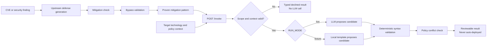
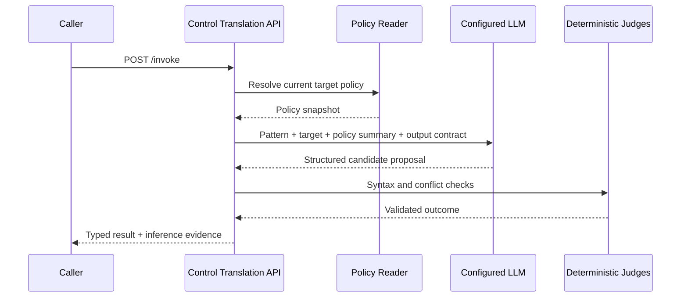
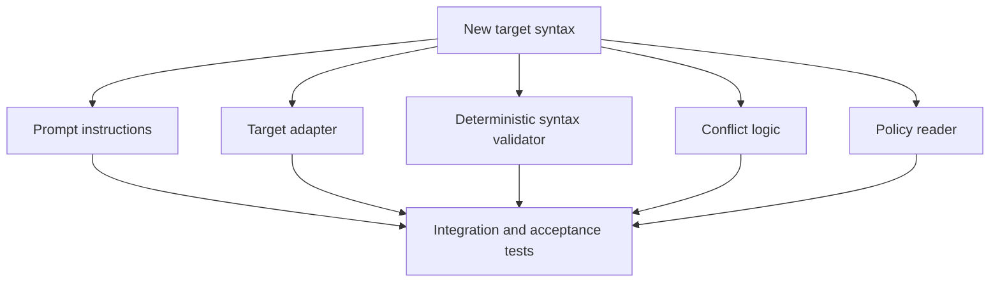
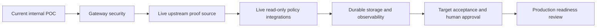

# control-translation service

Turns a proven mitigation pattern into a control-specific mitigation
candidate for a target technology (Akamai WAF, generic firewall, or an
EDR/S1 stub) — or a grounded reason it cannot be produced. Implements the
Janus `control-translation` Capability Functional Specification (CFS).

## Source provenance

- CFS source: `artifacts/capabilities/cfs-control-translation.md` in the
  `apm0000000-ai-tiger-team-janus` repo (v1.0). See `docs/cfs-source.md`.
- This is a standalone repo, independent of the Janus repo.

## Review docs

- CFS extraction: `docs/cfs-extraction.md`
- POC design: `docs/poc-design.md`
- Implementation / low-level design: `docs/LLD.md`
- Assumptions and follow-ups: `docs/assumptions-and-followups.md`

## What this service does

- Accepts a proven mitigation pattern + target technology/context.
- Reads a current policy snapshot (fixture-backed).
- Calls a translation agent (doer) to propose a candidate rule/config.
- Gates the proposal through deterministic syntax validation and conflict
  detection (judge) before allowing a `translated` verdict.
- Emits a typed `ControlTranslationResult` with one of five terminal
  states: `translated`, `cannot-express`, `insufficient-context`,
  `scope-declined`, `malfunction`.

It produces a **candidate only**. It does not approve, publish, or deploy a
rule to a target security product.

## End-to-end flow



The CVE is not itself the control. An upstream workflow uses the CVE or
finding to generate and prove a mitigation. This service receives that
`ProvenMitigationPattern` and translates it to a selected target.

## What is sent to the LLM

Only live mode calls a model. The server sends:

- target technology and expected artifact type;
- the proven discriminator description and mitigation summary;
- summaries from the resolved policy snapshot;
- target-format instructions and a strict structured-output contract.

The model is asked to return the candidate content, an `exact`, `equivalent`,
or `narrower` translation label, justification, assumptions, and limitations.
Credentials are sent only in the server-to-provider authorization header.
They are never accepted from or returned to the browser.



## What is real vs. fixture-backed

- **Real:** FastAPI HTTP surface, Pydantic contracts, terminal-state
  routing, deterministic syntax/conflict gates, and (when `RUN_MODE=live`)
  a real model call. AT&T Inference uses its OpenAI-compatible HTTP API;
  other configured providers use Pydantic AI.
- **Fixture-backed:** policy snapshot reads (no live Akamai/Palo
  Alto/SentinelOne API access), proven-mitigation-pattern samples (no real
  upstream `defense-generation`/`mitigation-check`/`bypass-validation`
  capabilities yet), and the default `FixtureTranslationDoer`.

See `docs/assumptions-and-followups.md` for the full list and backlog.

## Install & run

Requires Python 3.11+ and [uv](https://docs.astral.sh/uv/).

```bash
uv sync
uv run pytest -q
uv run uvicorn control_translation.api:app --reload
```

Then open http://127.0.0.1:8000/ for the demo UI, or
http://127.0.0.1:8000/docs for Swagger UI. The team flow guide is at
http://127.0.0.1:8000/demo.html.

## Configuration

Copy `.env.example` to `.env` and fill in real values as needed:

```bash
cp .env.example .env
```

Default `RUN_MODE=fixture` requires no model or API key. Set `RUN_MODE=live`
and provide all settings for the selected provider. No LLM base endpoint,
model ID, or API key is hardcoded in application code or the image.

| Variable | Required | Purpose |
|---|---|---|
| `RUN_MODE` | Yes | `fixture` or `live` |
| `MODEL_PROVIDER` | Live | `att-inference`, `openai`, or configured Pydantic AI provider |
| `MODEL_NAME` | Live | Tenant-approved model/deployment ID |
| `ATT_INFERENCE_BASE_URL` | AT&T live | OpenAI-compatible base URL, supplied at deployment |
| `ATT_INFERENCE_API_KEY` | AT&T live | Secret-store reference/value, never committed |
| `OPENAI_API_KEY` | OpenAI live | Secret-store reference/value |
| `AZURE_OPENAI_ENDPOINT` | Azure live | Deployment endpoint |
| `AZURE_OPENAI_API_KEY` | Azure live | Secret-store reference/value |
| `AZURE_OPENAI_API_VERSION` | Azure live | Provider API version |
| `MODEL_REQUEST_TIMEOUT_SECONDS` | No | Model timeout, `1-300`; default `60` |
| `HOST` | No | Bind host; default `0.0.0.0` |
| `PORT` | No | Bind port; default `8000` |
| `ENABLE_DOCS` | No | Enable `/docs`, `/redoc`, and `/openapi.json` |

### AT&T Inference

AT&T Inference is supported as an OpenAI-compatible live provider. Obtain
the model ID, OpenAI-compatible base URL, and API key from the AT&T
Inference tenant / approved secret store, then set these **server-side**
values in `.env` (or equivalent deployment secrets):

```dotenv
RUN_MODE=live
MODEL_PROVIDER=att-inference
MODEL_NAME=<ATT_INFERENCE_MODEL_ID>
ATT_INFERENCE_BASE_URL=<ATT_INFERENCE_OPENAI_COMPATIBLE_BASE_URL>
ATT_INFERENCE_API_KEY=<SET_FROM_SECRET_STORE>
```

Never put `ATT_INFERENCE_API_KEY` in the browser, source code, or a
committed `.env` file. The service only exposes a boolean indicating whether
credentials are configured; it never returns the key or endpoint through
`/inference`, `/schema`, or an invocation result.

For deployment, inject secrets through the platform secret store. Do not copy
a developer `.env` into an image. If a credential has appeared in a shared
screen, transcript, ticket, or log, revoke and rotate it before deployment.

### Switching modes and demonstrating LLM use

Mode selection is intentionally restart-based rather than a browser-side
toggle, so a UI visitor cannot set or receive a production credential.

1. In the demo UI's **Inference runtime** card, choose **AT&T Inference —
  live LLM** and select **Copy configuration**.
2. Paste the settings into `.env`, replace the three placeholders with
  approved tenant/secret-store values, and restart Uvicorn or the container.
3. Refresh the UI. The runtime card must show **Live LLM enabled**, the
  configured provider, and model.
4. Submit a compatible example with a known policy context, for example
  **CVE-2017-5638 → Akamai WAF**. The response includes an **Inference
  evidence** panel. `LLM invoked for this request: yes` demonstrates that
  the request reached the live translation agent. The deterministic syntax
  and conflict gates still run after model output.
5. To return to the offline demonstration, set `RUN_MODE=fixture` and
  restart. The runtime card and response will report fixture mode and
  `LLM invoked: no`.

If an input is rejected for scope or missing policy context before the
translation stage, it correctly reports `LLM invoked: no` even in live mode.

## Invoke

Direct Python:

```python
from control_translation import capability
from control_translation.contracts import ControlTranslationRequest, TargetContext
from control_translation.providers.fixtures import get_fixture_pattern

request = ControlTranslationRequest(
    proven_pattern=get_fixture_pattern("proven-pattern:CVE-EXAMPLE:waf:3"),
    target_context=TargetContext(
        target_technology="akamai-waf",
        target_policy_context_id="akamai-policy:example:rev-17",
    ),
)
result = capability.invoke(request)
```

HTTP:

```bash
curl -sS -X POST http://127.0.0.1:8000/invoke \
  -H 'content-type: application/json' \
  -d @examples/request-translated.json | jq
```

The full upstream object is accepted in every request; it is not tied to the
bundled CVE examples. A future upstream service can call `/invoke` directly as
long as it follows `schemas/request.schema.json`. Required proof lineage
includes at least one `mitigation-check-result:` and one
`bypass-validation-result:` reference.

### Changing input or target output formats

- **Different CVE/control, same contract:** no code change is required. Send
  the new proven pattern in `/invoke`.
- **Add optional upstream metadata:** update the Pydantic request contract,
  regenerate `schemas/request.schema.json`, and add compatibility tests.
- **Tune output for an existing target:** prompt changes can guide the model,
  but prompt changes alone are not a safe production change. Update the
  target adapter and deterministic syntax tests at the same time.
- **Add a new target technology:** add an adapter, register it in
  `ADAPTER_REGISTRY`, map its control class, add target prompt instructions,
  implement a policy reader/snapshot, and add syntax/conflict fixtures and
  tests.



This separation is intentional: the LLM constructs a proposal, while code
decides whether that proposal is structurally acceptable.

## HTTP endpoints

| Method | Path | Purpose |
|---|---|---|
| `GET` | `/health` | Process liveness |
| `GET` | `/ready` | Configuration/deployment readiness; returns `503` if invalid |
| `GET` | `/inference` | Safe mode/provider/model status; never returns keys/endpoints |
| `GET` | `/schema` | Capability and supported-target summary |
| `POST` | `/invoke` | Submit one translation request |
| `GET` | `/runs/{run_id}` | Read a result stored in this process |
| `GET` | `/docs` | Swagger UI when `ENABLE_DOCS=true` |
| `GET` | `/demo.html` | Team-friendly flow and demo guide |

## Terminal states

| State | Meaning |
|---|---|
| `translated` | One primary candidate produced; send to defense-validation. |
| `cannot-express` | Target technology cannot represent the pattern. |
| `insufficient-context` | Missing policy/context; gather and retry. |
| `scope-declined` | Target/config outside coverage, or unresolved policy conflict. |
| `malfunction` | Provider/tooling/result-assembly failure; retry or escalate. |

## CI and release gate

`.github/workflows/ci.yml` runs the complete test suite in fixture mode and
builds the container on each push and pull request. Live credentials are not
needed in CI. Protect the deployment branch so both jobs and required reviews
must pass before an image is promoted.

## Deployment

The repository is container-deployable for an internal POC/demo:

```bash
docker build -t control-translation-service:local .
docker run --rm -p 8000:8000 --env-file .env control-translation-service:local
```

The image does not contain `.env`, tests, local caches, or credentials. Its
startup command reads `HOST` and `PORT` from the environment. Its health check
uses `/ready`, so an invalid live-model configuration does not enter service.

For an orchestrator, configure:

1. non-secret variables from `.env.example`;
2. API keys from an approved secret store;
3. `/health` as liveness and `/ready` as readiness;
4. TLS, authentication, authorization, rate limits, and request-size limits
   at the API gateway;
5. centralized logs/metrics with input and candidate redaction rules;
6. one process replica until durable run storage is implemented.

Use `deploy/DEPLOYMENT.md` as the authoritative DevOps runbook. The older
`deploy/DEVOPS-HANDOFF.html` remains a presentation-oriented handoff.

## Release status and production limitations

**Current status: deployable as an internal POC, not ready for unrestricted
production or direct Internet exposure.** The API and model integration work,
but the following controls are required before production use:

- Replace `FixturePolicyReader` with authenticated, read-only target-policy
  integrations. Current conflict decisions use bundled snapshots.
- Connect a trusted upstream source and verify proof-record existence; today
  the API validates lineage shape but does not retrieve the proof records.
- Put the service behind enterprise authentication/authorization, TLS, rate
  limiting, request-size limits, and network allowlists.
- Replace the in-memory `_RUNS` dictionary with a durable store if run lookup,
  multiple workers, restarts, or horizontal scaling are required.
- Add provider retry/backoff, circuit breaking, quotas, and production
  telemetry. The current model call has a configurable timeout but no retry.
- Complete target-owner acceptance tests against non-production Akamai,
  firewall, and EDR tenants. Current validators check supported structure,
  not vendor acceptance or semantic safety.
- Define human approval, change-management, rollback, and deployment ownership.
  This service intentionally does not deploy candidates.
- Add prompt/version governance, model evaluation, adversarial-input testing,
  and output-quality thresholds before changing prompts or models.
- Rotate any credential previously exposed outside its approved secret store.



## Final deployment decision

Deploy now only for controlled demos, integration development, or an internal
POC environment. Do not describe a `translated` result as production-ready:
it means the candidate passed the validators currently implemented in this
repository. Production approval remains a target-owner and change-management
decision.
