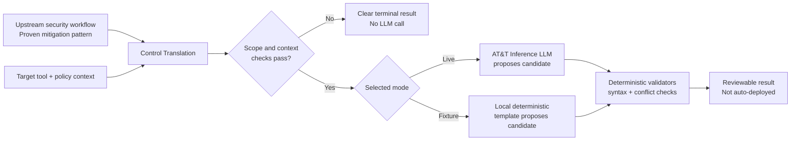
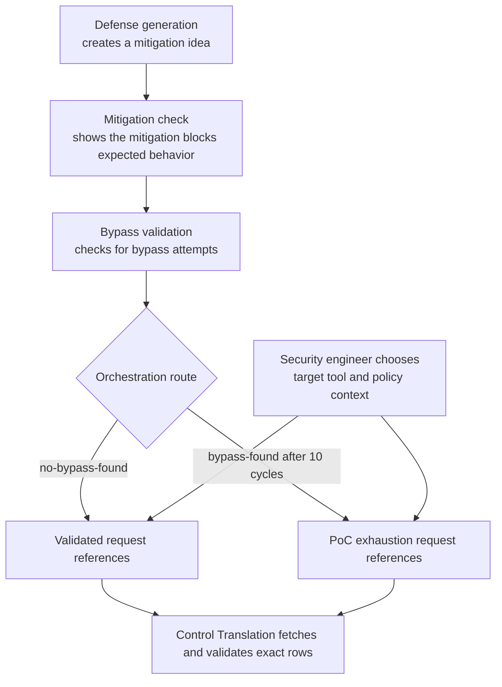
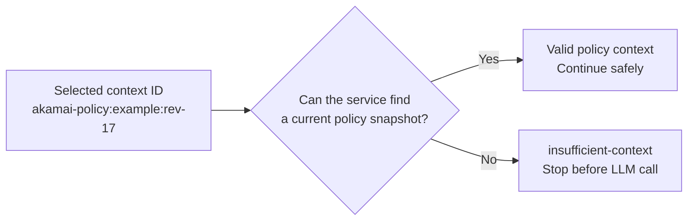
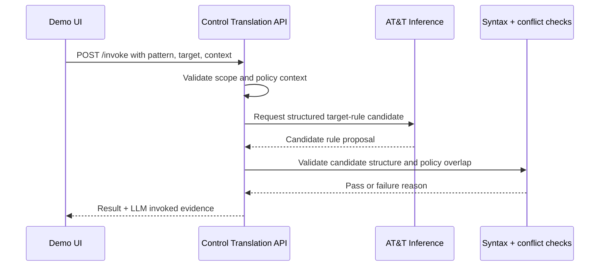

# Control Translation — Team Demo Guide

> **One-line summary:** This service turns a proven security mitigation pattern into a reviewable candidate rule for a target tool such as Akamai WAF, a firewall, or SentinelOne EDR.

## What to show in the demo

1. Open the demo UI: `http://127.0.0.1:8080/`. The UI is its own service; the capability API runs separately on `:8000`.
2. Point out **Inference runtime** at the top.
   - **Live LLM enabled** means AT&T Inference creates the first candidate.
   - **Fixture mode** means local, repeatable templates create the first candidate.
3. Leave the default example selected:
   - **CVE-2017-5638 — Apache Struts**
   - Target: **Akamai WAF**
   - Policy context: **akamai-policy:example:rev-17**
4. Click **Translate**.
5. In the result, show the terminal state, candidate artifact, limitations, and **Inference evidence**.
6. Scroll to **Stored runs and translations**. Show that the completed run is
    visible after refresh, then select **View** to retrieve its durable result.

## Simple end-to-end flow



### In plain language

- **Upstream security workflow:** supplies exact result references after either
    a validated proof loop or the approved ten-cycle PoC exhaustion route. This
    service does not invent a vulnerability finding.
- **Control Translation:** converts that pattern into the syntax of a chosen target tool.
- **LLM or fixture:** creates the initial rule candidate.
- **Deterministic validators:** check the structure and look for policy conflicts.
- **Result:** gives the team a candidate to review. It never pushes a rule into production.

## Where the input comes from



The repository supports exact upstream records from the three authoritative
Unity Catalog result tables. Fixture records remain available for offline
tests and demos. Target policy snapshots are still fixture-backed. An exhausted
candidate is explicitly reported as `bypass_cleared=false`; it is not presented
as equivalent to `no-bypass-found`.

## What does “valid policy context” mean?

A **policy context** is the current configuration environment where the candidate rule would eventually live.

For this demo, this is selected by an ID such as:

```text
akamai-policy:example:rev-17
```

That ID lets the service retrieve a policy snapshot containing information such as:

- target technology, for example `akamai-waf`;
- current policy revision or snapshot identifier;
- a summary of rules that already exist;
- information needed to identify obvious overlap or conflict.

A context is **valid** when the service can find a current snapshot for the selected target technology and context ID.



### Why it matters

Without policy context, the service may create a rule that duplicates, overlaps with, or conflicts with an existing rule. It therefore stops with `insufficient-context` instead of guessing.

> The current repository uses fixture-backed policy snapshots. It does **not** yet connect to a live Akamai, firewall, or SentinelOne policy API.

## What the LLM does vs. what the service does

| Step | Live LLM mode | Fixture mode |
|---|---|---|
| Create initial candidate | AT&T Inference proposes it | Local template proposes it |
| Network/model cost | Yes | No |
| Same output every time | Not guaranteed | Yes |
| Syntax validation | Yes | Yes |
| Policy conflict check | Yes | Yes |
| Automatic deployment | Never | Never |

### Live LLM path



The UI result says **`LLM invoked for this request: yes`** only when the request reaches AT&T Inference.

## Quick team talk track

> “This service takes a proven mitigation pattern and translates it into a candidate rule for a target security tool. We select the pattern, target tool, and policy context. The policy context represents the existing configuration where the rule may be used. The service checks that this context exists before it calls the LLM.”
>
> “In live mode, AT&T Inference proposes the first version of the candidate rule. In fixture mode, a local template does that instead. Either way, the service runs deterministic syntax and conflict checks afterward.”
>
> “The result is not an automatic deployment. It is a reviewable candidate with assumptions and limitations. The Inference evidence panel tells us whether a live LLM was used for that request.”

## What to point out in the result

| Result area | Meaning |
|---|---|
| `translated` | Candidate passed the available syntax and conflict checks. |
| Candidate artifact | The target-specific candidate rule/configuration. |
| Translation | `exact`, `equivalent`, or `narrower` coverage compared with the source mitigation. |
| Assumptions and limitations | Conditions, known gaps, and reasons for human review. |
| Inference evidence | Mode, provider, model, and whether the LLM was invoked. |

## Durable run dashboard

The dashboard at the bottom of `/` reads persisted run summaries from
`GET /v1/runs`. It displays completion time, vulnerability, target, terminal
state, and artifact type without downloading every stored request or candidate.
Selecting **View** retrieves that run through `GET /runs/{run_id}` and displays
its translation summary, outcome, and an initially collapsed candidate artifact.

Use the dashboard to demonstrate that results survive a browser refresh and a
service restart when the same SQLite volume is retained. Candidate artifacts
may contain security-control logic, so do not expose the dashboard outside the
approved authenticated environment.

## Other possible outcomes

| State | Simple meaning |
|---|---|
| `translated` | A validated candidate was produced. |
| `scope-declined` | Target/input is unsupported or a policy conflict was found. |
| `insufficient-context` | The selected policy context cannot be found. |
| `cannot-express` | The target cannot represent this mitigation pattern. |
| `malfunction` | A provider or internal processing issue occurred. |

## API endpoints for the demo

| Method | Endpoint | Use |
|---|---|---|
| `GET` | `/` | Demo UI |
| `GET` | `/inference` | Current mode, provider, model, and credential status without secrets |
| `POST` | `/invoke` | Submit a translation request |
| `GET` | `/v1/runs?limit=25&offset=0` | Retrieve a bounded page of safe run summaries |
| `GET` | `/runs/{run_id}` | Retrieve a durable prior completion envelope |
| `GET` | `/v1/results/{result_id}` | Retrieve a durable structured result |
| `GET` | `/docs` | Swagger UI |
| `GET` | `/health` | Health check |

## Important boundaries

- The API key stays server-side; it is never displayed in the UI or API response.
- The LLM proposes a candidate; it does not approve or deploy it.
- Deterministic validators run after the candidate is created.
- The target-policy readers are fixture-backed today; live target-system integrations are future work.
- A compensating control does not replace applying the official vendor patch or remediation.
